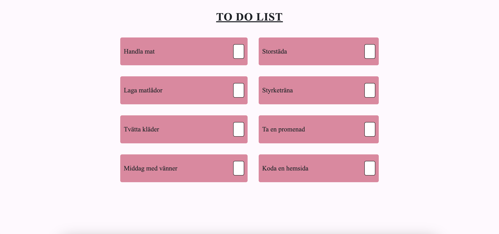

# Todo - Typescript
A todo-list application built with [Vite](https://vite.dev/) and TypeScript. The page displays a list of tasks to be completed. These tasks appear on the screen in the form of a list. Once a task is completed, the user can mark it as done, and the task will be removed from the list.

## Requirements

* A hardcoded todo-list
* Display in a HTML structure, such as an ul/li list. 
* Implement click event to handle the removal of a todo.
* The todo is removed from the page and marked as done in the javascript list. 

**HTML & CSS**
* Mobile first
* One breakpoint
* Scss (nesting, variables, etc.)
* Use mixins to make the application responsive

## DEMO



## Installation
### 1. Clone this repository
```
https://github.com/malinjansson/TodoTypeScript.git
```

### 2. Navigate to the project folder
```
cd TodoTypeScript
```

### 3. Install dependencies
```
npm install
```

### 4. Run the application
```
npm run dev
```
The application will be available at local: http://localhost:5173/

